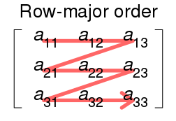
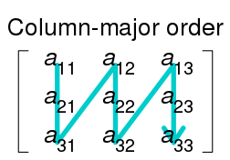

# Col Major, Row Major
    2차원 이상의 배열을 저장할 떄 적용되는 것으로 2차원 이상의 것들을 한 줄로 쫘 펼칠 때 내 옆에 어느 것이 저장될 것인가에 대한 규칙 같은것
## Row Major
    Row 단위로 저장을 하는 것
한 행을 완전히 저장하고 다음 행을 저장한다는 것

한 줄로 펼치면

[ a11 a12 a13 a21 a22 a23 a31 a32 a33 ]

순으로 저장이 됨

## Col Major
 Column 단위로 저장을 하는 것

 한 여을 완전히 저장하고 다음 열을 저장하는것

[ a11 a21 a31 a12 a22 a32 a31 a32 a33 ]

순으로 저장이 됨

언어마다 기본적으로 어떤 것을 사용할 것인지 정해져 있음 그 중 C/C++ 언어는 row-major 행을 기준으로 사용

왜 중요한가?
> 연속적인 배열 참조시 cache memory운용 떄문

지역성(locality)을 생각해야함

## Spatical locality
공간 지역성으로 메모리 주변에 있는 것들이 앞으로 참조될 가능성이 높음

## temporal locality
그 메모리를 한번 접근했을 때 같이 참조했던 것들을 아프올 참조될 가능성이 높음

병렬처리할 때나 캐시 메모리 접근 할 때 이러한 가능성이 존재한다 정도만 알면 됨