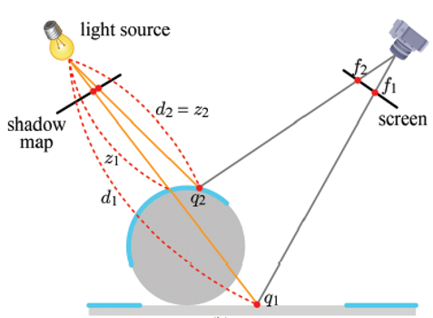

# Defferd Rendering
포워드 렌더링과 달리 모든 조명을 한번에 처리하지 않고 여러 단계로 나누어 처리하는 기법

멀티 렌더 타겟 MRT 방식을 이용하여 여러개의 지오메트리 버퍼 (G-buffer) 에 오브젝트의 다양한 정보들을 한꺼번에 렌더링

라이트를 마지막까지 계산하지 않고 있다가 나중에 한번에 계산 오브젝트 단위로 계산하지 않기 때문에 연산량이 많이 줄어들음

1. 자오메트리 패스
장면의 기본 정보를 G-buffer에 위치 노멀 재질 정보 등 조명을 계산하는데 필요한 데이터를 저장

2. 조명 패스
g-버퍼를 바탕으로 각 픽셀에 대한 조명을 계산

이 단계에서 모든 조명이 한 번에 처리됨

3. 최종 합성
조명 정보와 색상 정보를 결합하여 최종 이미지를 생성

# Tiled-Based Rendering
    화면을 작은 타일로 나누어 각 타일을 개별적으로 렌더링하는 기법

## 렌더링 방법
드로우 콜이 발생하면 레스터화까지는 진행을 하고 픽셀 쉐이더로 넘어가지 않고 타일을 선택하는 과정을 거침

선택된 타일만 렌더링함

1. 씬에서 화면을 타일들로 세분화함
2. 그 타일들을 기반으로 타일내 오브젝트에 영향을 주는 조명을 버퍼에 저장
3. 각 타일들에 저장된 조명을 연산 후 개별적으로 렌더링

계산해야하는 픽셀 수가 줄어들게 됨

# Tile-Based Deferred Rendering
    Tiled-Based Rendering에서 파생된 방법
    
기본적으로는 Tiled-Based Rendering방법으로 진행되지만 모든 드로우콜이 끝날 때 까지 타일을 버텍스 셰이더에서  버퍼에 저장 해 두었다가 모든 드로우 콜이 끝나면 픽셀 셰이더로 넘겨줘서 들어오는 타일에 대해서 한번에 처리가 가능함

## 장점
한 타일안에 들어오는 모든 폴리곤을 한번에 처리

보이는 픽셀만 렌더링 하기 때문에 렌더링 효율성을 극대화

## 단점
렌더링 전에 전체 프레임에 대한 데이터를 복사해두어야함 메모리를 많이 사용

# Pre-pass Light Deferred Rendering
디퍼드 렌더링의 변형 기법

1. 노멀과 깊이 정보 저장
장면의 각 픽셀에 대한 노멀과 깊이 정보만을 G-버퍼에 저장

2. 조명 계산
노멀과 깊이 정보를 사용하여 조명을 계산하는데 각 조명에 대한 계산이 이루어지고 그 결과가 조명 버퍼에 저장됨
- 한번에 합쳐진 조명값을 저장 함

3. 최종 이미지
기본 색상 정보를 다시 렌더링 조명 버퍼의 정보를 이용해 이미지 생성
- 조명 처리가 미리 계산되어 있어 조명 처리가 간단하게 이루어 짐

# inferred Light Defferd Rendering
    조명 정보를 직접 저장하는 대신, 조명을 간접적으로 추론하거나 예측하여 계산을 더 효율적으로 처리

조명 예측
- 조명 계산을 직접 수행하는 대신 조명 정보를 예측하거나 추론하는 기술을 이용
- 조명 계산을 단순화 하고 불필요한 계산을 줄여 성능 향상

조명 데이터 저장
- 조명 정보를 저장하는 대신 간접적으로 조명 데이터를 추로할수 있는 방법을 사용

성능향상
- 복잡한 조명계산을 단순화하고 렌더링파이프라인의 효율성을 개선

## 구현
### 1. Geometry pass
낮은 해상도로 노멀 값과 깊이값 그리고 DSF정보를 저장
- DSF란 이미지에서 급격한 색상 또는 밝기 변화가 있는 부분을 감지하고, 이러한 변화가 중요한 정보를 포함하고 있을 가능성이 높다는 점을 인식하여 필터링을 수행하는 것
### 2. Light pass
Ambient와 Dynamic Light를 계산한 정보를 버퍼에 담아둠
- Light가 영향을 주는 영역만 Stencil을 이용해서 그림

### 3. Material pass
이전에 계산한 버퍼를 이용해서 최종 렌더링

불투명한 오브젝트를 먼저 그리고 투명한 오브젝트를 뒤에서 앞으로 렌더링

이때 이전에 패스에서 담아둔 해상도가 낮기 때문에 DSF를 이용해서 해결 

# Shadow Map
Shadow map은 빛의 관점에서 장면을 렌더링하고 그 관점에서 물체의 깊이 정보를 텍스쳐로 저장하는 것

## 과정
두번의 렌더링 패스를 통해 수행

1. 빛의 관점에서 렌더링
    -  광원까지의 거리를 저장 ( 깊이 정보 ) 
    - 이를 광원기준의 깊이맵이라고도 함

2. 카메라 관점에서 그림자 판정

카메라가 보고있는 좌표까지의 거리를 깊이맵과 비교
- 바라보는 거리가 깊이값보다 길면 그림자가 지고있음
- 같다면 빛이 비춰지고 있다는 것임

## 장점
1. 효율적인 꼐산
    - 다른 그림자 생성 방법에 비해 계산이 효율적임
    - 간단한 연산만으로 계산이 가능하기 떄문에 복잡한 모양의 물체라도 간단하게 계산이 가능함

2. 다양한 빛 효과 구현
    - 각기 다른 빛의 관점에서 별도의 깊이 맵을 생성할 수 있음
    - 여러 광원에 의한 그림자를 개별적으로 계산이 가능하기 떄문

3. 동적인 그림자
    - 매 프래임마다 갱신 될 수 있어서 물체나 조명의 이동에 따라 그림자를 실시간으로 변경이 가능함

## 단점
1. 해상도
    - 섀도우 맵의 해상도가 낮으면 그림자가 뭉개지거나 계단현상이 발생할 수 있음

    - 그림자를 표현할 영역이 너무 크다면 그림자가 정확하게 글려지지 않을 수 이씅ㅁ

## 하드 섀도우, 소프트 썌도우
하드 섀도우
    - 점 광원의 경우 빛을 받는 지역과 받지 않는 지역이 명확하게 구분됨 이런 그림자를 하드 섀도우라고함

소프트 섀도우
    - 점과원과 다르게 면적을 가진 광원인 영역광원으로 그림자의 경계가 명확하지 않다.

    - 면적이 있기 때문에 각 끝에서 광원이 보는 관점이 다르기 때문에 그림자가 다르게 생성됨
    - 겹치는 부분은 뚜렸하게 겹치지 않는 부분은 연하게 해서 그램자를 렌더링함

# Instancing
3D 그래픽스에서 동일한 오브젝트를 여러번 렌더링할 때 사용하는 기술로 한번의 드로우 콜로 동일한 오브젝트를 한번에 렌더링하는 방법

## 과정
1. 렌더링 모델 준비
    - 렌더링할 오브젝트를 준비
    - GPU에 한번만 올라갈 것임

2. 데이터 설정
    - 각 인스턴스들의 고유 위치, 크기 ,회전 정보를 저장
    - 버퍼에 저장된 것을 GPU로 전달

3. 렌더링
    - GPU는 한번의 드로우 콜로 모든 인스턴스를 동시에 처리 동일한 모델을 여러개를 한번에 그리는 것

## 장점
1. 성능향상 ( 드로우콜 감소 )
    - 다수의 오브젝트를 같은 모델이라면 한번에 처리가 가능하기 때문에 드로우 콜이 줄어들어 성능이 향상됨

2. 메모리 절감
    - 오브젝트 데이터를 여러번 저장하지 안고 한번만 저장하고 재사용하기 때문에 메모리 절감

3. 유연성
    - 같은 오브젝트를 사용하기 때문에 크기나 위치 회전만 변경해주어도 다양하게 변형이 가능

## 단점
1. GPU 메모리 의존성
    - 아무리 적은 메모리를 적게 써도 너무 많은 인스턴스를 렌더링하면 메모리와 연산 자원에 부담이 될 수 있음

2. 제한된 다향성
    - 동일한 오브젝트의 복제본을 이용하기 떄문에 렌더링할 때만 효율적임
    - 각 인스턴스가 크게 다른 형태나 구조를 가지면 적합하지 않음

# MRT
    한 번의 렌더링 패스로 여러개의 렌더 타겟에 출력을 기록할 수 있는 기술

하나의 드로우 콜로 여러 개의 텍스처나 버퍼에 동시에 데이터를 쓸 수 있게 해주는 기능

# MRT와 SRT의 차이점
가장 큰 차이점은 렌더링 결과를 기록하는 타겟의 수

- SRT
    - 한 번에 하나의 렌더 타겟만 데이터를 쓸 수 있음 
    - 여러가지 렌더링 데이터를 얻고 싶으면 동일한 장면을 여러번 그려야함
    
- MRT
    - 한번의 드로우 콜로 여러 렌더 타겟에 데이터를 기록할 수 있음
    - 여러번 렌더링 할 필요가 없이 복잡한 효과를 구현 가능함

# 장점
1. 성능 최적화
    - 한번의 드로우 콜로 동시에 기록하기 떄문에 반복적인 작업을 줄여 CPU와 GPU의 통신 부담을 줄임

2. 복잡한 셰이더 효과 구현
    - 동시에 다른 데이터들을 다른 렌더 타겟에 저장 해 두었다가 복잡한 효과를 구현할 때 가져다가 사용할 수 있음

# Reflection
    거울이나 물의 표면과 같이 물체가 반사되는 것

## Planar Reflection
반사효과를 적용하지 않은 부분을 한번 렌더링한 후에 반사상 데이터를 이용해 반사효과가 적용되는 부위를 다시 렌더링

시점을 반사될 공간으로 이동해서 렌더링

거울처럼 대칭으로 렌더링이 됨

- 드로우 콜이 반사되는 Object에 비례해서 증가
- 평면만 반사가능

## Cube Map Reflection
6개의 평면으로 구성된 Texture를 의미 이 Cubemap을 이용해서 반사효과를 구현할 수 있음

카메라 시점에서 cubemap의 데이터를 반사sample을함

카메라에서 주전자 방향의 벡터와 반사되는 벡터를 찾고 그 벡터가 향하는 것을 규브맵에서 샘플링함

뷰의 방향 벡터와 오브젝트의 법선 벡터를 이용해 반사벡터 R을 계산

reflect함수를 이용해서 구하면 되지만 정확한 수식은

$$
R = I - 2 * (N \cdot I ) * N
$$

입사 벡터와 법선벡터를 알면 구할 수 있음

# 커맨드 버퍼
CPU에서 GPU에 필요한 데이터를 넘겨주며 오브젝트를 그리라고 하는 것을 드로우 콜이라고 한다.

GPU는 독립적으로 작업을 수행하고 있기 때문에 CPU의 명령은 중간에 커맨드 버퍼에 저장되었다가 현재 작업을 완료하면 GPU로 전달된다.

한번의 드로우콜이 커맨드버퍼에 저장되었다가 넘겨짐

인스턴싱을 이용하면 같은 오브젝트를 한번에 그리기 때문에 여러번의 드로우콜을 한번으로 줄일 수 있음

# Shader Resource view , Unordered acesse view
셰이더 리소스 뷰는 일반적으로 셰이더가 텍스처에 액세스할 수 있는 형식으로 텍스처를 래핑합니다. 
Unordered acesse view는 유사한 기능을 제공하지만, 순서와 상관없이 텍스처(또는 다른 리소스)에 대한 읽기 및 쓰기를 허용합니다.

단일 텍스처 래핑이 가장 단순한 형태의 셰이더 리소스 뷰입니다. 보다 복잡한 예는 하위 리소스(mipmap 텍스처의 개별 어레이, 평면 또는 색)의 모음, 3D 텍스처, 1D 텍스처 색 그라데이션 등이 될 것입니다.

Unordered acesse view는 성능 면에서 약간 더 많은 비용이 들지만, 예를 들어 텍스처를 읽는 동시에 쓸 수 있습니다. 그러면 그래픽 파이프라인이 업데이트된 텍스처를 다른 용도로 재사용할 수 있습니다. 셰이더 리소스 뷰는 읽기 전용입니다(리소스의 가장 일반적으로 용도).

# 알파 소팅
알파가 없는 오브젝트들은 화면 앞의 오브젝트 부터 뒤에 있는 오브젝트 순으로 렌더링 하면 됨
- backface culling으로 뒤에 가려진 오브젝트는 렌더링을 안하기 때문

하지만 반투명이거나 투명 오브젝트들은 뒤에있는 오브젝트가 그려져야하기 때문에 반대로 뒤에서부터 앞으로 그려져야 함
- 불투명 오브젝트를 먼저그림 그다음 불투명 오브젝트를 그림

때문에 알파값이 있는 것과 없는것을 나누어서 따로 그리게 됨